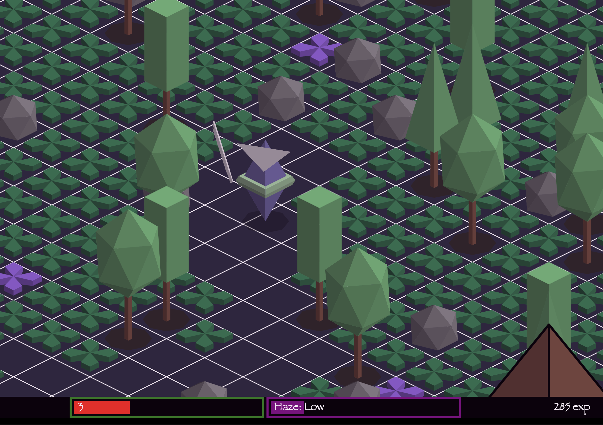

# Four, Oh, Four (JS13k 2020)

JS13k is 30-day competition to create a browser game in 13kb of code or less. This is my 2020 entry.

I documented my work in a 3 part dev log:

- [Pt 1: Theme Announcement & Project Setup](https://markracette.notion.site/Pt-1-Theme-Announcement-Project-Setup-94ac8122d8f148d8a9f071ce3f34a0e4)
- [Pt 2: Writing a 3D Engine (after trying not to)](https://markracette.notion.site/Pt-2-Writing-a-3D-Engine-after-trying-not-to-b3b3fb348f3242f389f5f95490641285)
- [Pt 3: Using Bitmap Caching to Unlock 60fps in 3 Dimensions](https://markracette.notion.site/Pt-3-Using-Bitmap-Caching-to-Unlock-60fps-in-3-Dimensions-c4054f1477dd4f628ddcc7fc2821c754)

# Check it out

You can see my entry and play the game [here](https://js13kgames.com/entries/four-oh-four)

